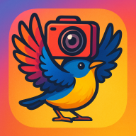
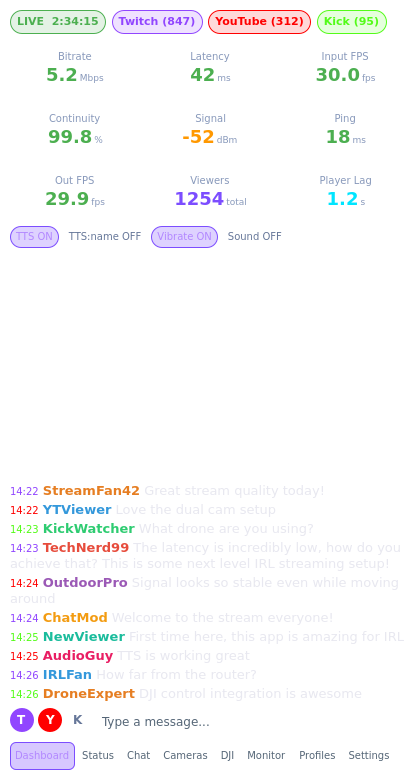

<p align="center">
  
</p>

<h1 align="center">WingOut</h1>

<p align="center">
  <strong>Professional IRL streaming control &amp; monitoring for Android</strong>
</p>

<p align="center">
  <a href="#features">Features</a> &bull;
  <a href="#screenshot">Screenshot</a> &bull;
  <a href="#architecture">Architecture</a> &bull;
  <a href="#building">Building</a> &bull;
  <a href="#license">License</a>
</p>

---

WingOut is a Qt/QML + Go application for real-time monitoring and control of IRL (In Real Life) video streams. It connects to [StreamD](https://github.com/xaionaro-go/streamctl) and [FFStream](https://github.com/nicknamenamenick/FFStream) backends to provide a unified dashboard for managing multi-platform streams to Twitch, YouTube, and Kick simultaneously.

## Screenshot

<p align="center">
  
</p>

*Dashboard view with real-time metrics (bitrate, latency, FPS, continuity, signal strength), multi-platform viewer counts, notification controls (TTS, vibrate, sound), and unified chat from Twitch, YouTube, and Kick.*

## Features

### Stream Monitoring
- **Real-time metrics** — bitrate, latency (pre-send + sending), input/output FPS, continuity, ping
- **Multi-platform viewer counts** — Twitch, YouTube, Kick with per-platform badges
- **Signal strength** — WiFi RSSI and SSID monitoring
- **Channel quality** — per-channel quality indicators from the backend
- **Stream uptime** — live timer with player lag tracking

### Chat
- **Unified multi-platform chat** — Twitch, YouTube, Kick messages in a single view
- **Text-to-Speech** — configurable TTS with optional username reading and bot filtering
- **Notifications** — vibration and sound alerts for new messages
- **Send to platforms** — compose and send messages to selected platforms
- **Full-width wrapping** — chat text wraps efficiently without wasted space
- **Scroll lock** — scrolling up pauses auto-scroll; tap the arrow button to jump back

### Streaming Control
- **Stream profiles** — save and switch between streaming configurations
- **Restreams** — manage stream forwarding rules (source to sink)
- **Camera sources** — add/remove RTMP input sources
- **Live preview** — RTMP video playback monitor
- **Configuration editor** — YAML config editing with apply/save/reload
- **Backend modes** — embedded (daemon bundled in APK), remote, or hybrid

### DJI Drone Integration
- **Bluetooth control** — connect to DJI Osmo Pocket 3, Action 4/5 Pro
- **WiFi pairing** — automatic WiFi credential exchange over BLE
- **RTMP streaming** — configure the drone's RTMP output directly from the app

### Platform
- **Android** (ARM64, x86_64) — primary target with embedded Go daemon
- **Linux desktop** — for development and desktop streaming setups
- **Theming** — Dark, Light, Midnight, Sunset, Ocean, Forest themes
- **Accessibility** — full ARIA names on all interactive elements

## Architecture

```
┌──────────────────────────────────────────────────┐
│                  Android Device                   │
│                                                   │
│  ┌─────────────────┐    ┌─────────────────────┐  │
│  │   Qt/QML UI     │    │  wingoutd (Go)      │  │
│  │                 │◄──►│  gRPC server        │  │
│  │  Material theme │gRPC│                     │  │
│  │  11 pages       │    │  ┌───────────────┐  │  │
│  │  GlassCard UI   │    │  │ FFStream      │  │  │
│  └─────────────────┘    │  │ backend       │  │  │
│           │              │  └───────┬───────┘  │  │
│      JNI bridge          │  ┌───────┴───────┐  │  │
│           │              │  │ StreamD       │  │  │
│  ┌────────┴────────┐    │  │ backend       │  │  │
│  │  WingOutDaemon  │    │  └───────────────┘  │  │
│  │  (Java)         │    └─────────────────────┘  │
│  │  Process mgmt   │                             │
│  └─────────────────┘                             │
└──────────────────────────────────────────────────┘
         │                        │
         │                   TLS/gRPC
         │                        │
    ┌────┴──────────────────────────────┐
    │        Remote Backends            │
    │  StreamD (chat, status, config)   │
    │  FFStream (video, encoding)       │
    └───────────────────────────────────┘
```

The Qt/QML frontend communicates with the Go daemon (`wingoutd`) over gRPC. On Android, the daemon is bundled as a native library (`libwingoutd.so`) and launched via JNI. The daemon connects to StreamD and FFStream backends for stream control and video processing.

## Building

### Prerequisites

- **Qt 6.10+** with: Quick, QuickControls2, Protobuf, Grpc, Bluetooth, Multimedia, TextToSpeech
- **Go 1.25+**
- **Android SDK** (API 28+) and **NDK 28** (for Android builds)
- **protoc** with Go and Go-gRPC plugins

### Desktop

```bash
make frontend    # Build Qt frontend
make backend     # Build Go daemon
make test        # Run Go + QML tests
```

### Android APKs

```bash
make apk-arm64   # ARM64 APK → /tmp/wingout2-arm64.apk
make apk-x86_64  # x86_64 APK → /tmp/wingout2-x86_64.apk
make apk-all     # Both architectures
```

### Protobuf

```bash
make proto       # Regenerate Go gRPC stubs from proto/wingout.proto
```

Qt protobuf/gRPC stubs are generated automatically by CMake.

## Project Structure

```
.
├── cmd/wingoutd/       # Go daemon entry point
├── pkg/
│   ├── api/            # gRPC server implementation
│   ├── backend/        # StreamD + FFStream backend clients
│   └── wingoutd/       # Daemon lifecycle and config
├── proto/              # Protobuf/gRPC service definition
├── qml/
│   ├── Main.qml        # App shell, navigation, settings
│   ├── Theme.qml       # Theming engine (6 themes)
│   ├── components/     # GlassButton, GlassCard, MetricTile, etc.
│   ├── dialogs/        # Initial setup wizard
│   └── pages/          # Dashboard, Chat, Cameras, DJI, etc.
├── src/                # C++ controller layer (gRPC client, JNI, platform)
├── android/            # Android manifest, Java classes, resources
├── resources/          # Fonts, audio assets
└── tests/              # QML unit tests, Go tests, E2E tests
```

## License

[0BSD](LICENSE) — Zero-Clause BSD. Use it however you want.

Qt components are used under the [LGPL v3](https://www.gnu.org/licenses/lgpl-3.0.html).
